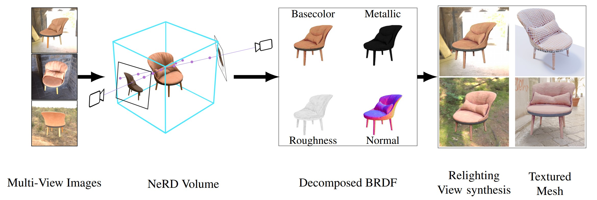

# NeRD: Neural Reflectance Decomposition from Image Collections

### [Project Page](https://markboss.me/publication/2021-nerd/) | [Video](https://youtu.be/JL-qMTXw9VU) | [Paper](https://markboss.me/files/2020-NeRD.pdf)

Implementation for NeRD. A novel method which decomposes multiple images into shape, BRDF and illumination.
<br><br>
[NeRD: Neural Reflectance Decomposition from Image Collections](https://markboss.me/publication/2021-nerd/)<br>
[Mark Boss](https://markboss.me)<sup>1</sup>, [Raphael Braun](https://uni-tuebingen.de/en/fakultaeten/mathematisch-naturwissenschaftliche-fakultaet/fachbereiche/informatik/lehrstuehle/computergrafik/lehrstuhl/mitarbeiter/raphael-braun/)<sup>1</sup>, [Varun Jampani](https://varunjampani.github.io)<sup>2</sup>, [Jonathan T. Barron](https://jonbarron.info)<sup>2</sup>, [Ce Liu](http://people.csail.mit.edu/celiu/)<sup>2</sup>, [Hendrik P. A. Lensch](https://uni-tuebingen.de/en/faculties/faculty-of-science/departments/computer-science/lehrstuehle/computergrafik/computer-graphics/staff/prof-dr-ing-hendrik-lensch/)<sup>1</sup><br>
<sup>1</sup>University of Tübingen, <sup>2</sup>Google Research 
<br><br>



## Citation

```
@article{Boss2020-NeRD,
  author  = {Boss, Mark and Braun, Raphael and Jampani, Varun and Barron, Jonathan T. and Liu, Ce and Lensch, Hendrik P.A.},
  title   = {NeRD: Neural Reflectance Decomposition from Image Collections},
  journal = {CoRR},
  year    = {2020}
}
```